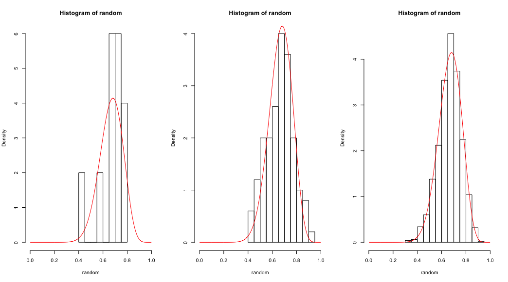
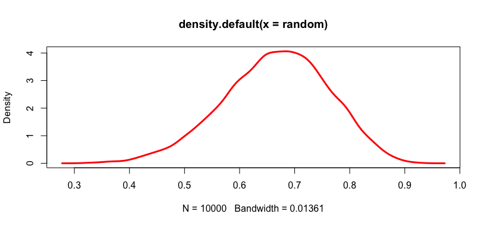
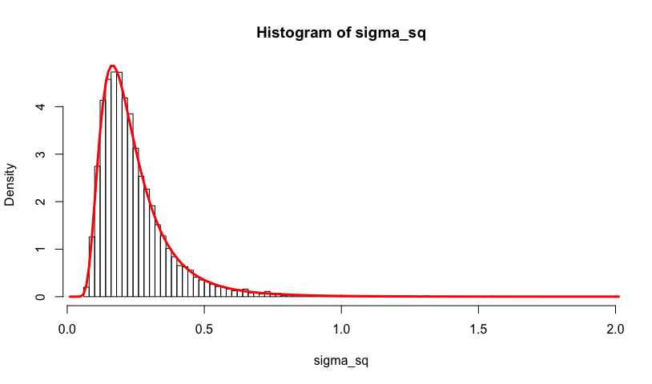
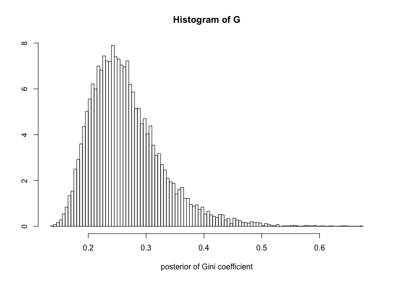
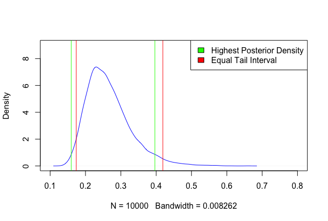
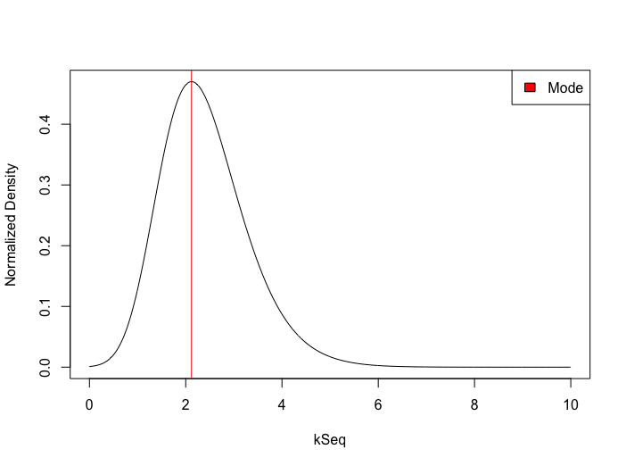

```{r setup, include=FALSE}
knitr::opts_chunk$set(echo = TRUE)
```

\newpage

#1. Bernoulli ... again

## 1a)

The posterior converges towards the true values with rising number of draw, represented below with 10, 100, 1000 draws.



## 1b)

The posterior was simulated with 10000 draws, resulting in $P(\theta < 0.4 | y) = 0.0043$. Real value using pbeta = 0.003973.

\newpage

## 1c)
Visualization of the log odds $\phi = log(\frac{\phi}{1-\phi})$ by simulation, using 10000 draws.



\newpage

#2. Log-normal distribution and the Gini coefficient

## 2a)

Simulation of the posterior distribution of $\sigma^{2}$ with 10,000 draws (histogram) compared to the theoretical distribution (line).'



\newpage

## 2b)

The posterior distribution of the Gini coefficient based on the draws in a).



\newpage

## 2c)
Due to the long right tail, the Equal Tail Interval was slightliy shifted to the right. The Highest Posterior Density interval produced a better representatition of the data.



\newpage

#3. Bayesian inference for the concentration parameter in the von Mises distribution

The distribution of $\kappa$ was calculated as the product of the likelihood and the prior, where the likelihood was assumed to be the product of the individual probabilities due to independent observations.



\newpage

# 1 - Code

```{r, echo=TRUE, eval=FALSE}
alpha <- 2
beta <- 2
s <- 14
n <- 20
nDraws <- c(10, 100, 1000)

# 1a

xGrid <- seq(0.001, 0.999, by=0.001)
posterior = dbeta(xGrid, alpha + s, beta + (n-s))
par(mfrow=c(1,3))
for (draws in nDraws) {
  random = rbeta(draws, alpha+s, beta+(n-s))
  hist(random, xlim = c(0,1), freq = FALSE, breaks=10)
  lines(xGrid, posterior, type='l', col ='red')
}
dev.off() 

# 1b

nDraws <- 10000
random = rbeta(nDraws, alpha+s, beta+(n-s))
val <- random * (random < 0.4)
print(sum(val>0)/length(val))

# 1c
nDraws <- 10000
random = rbeta(nDraws, alpha+s, beta+(n-s))
phi <- log(random/(1 - random))
plot(density(random), lwd=3, type='l', col='red')
```

\newpage

# 2 - Code
```{r echo=TRUE, eval=FALSE}
# -----------A-------------
income <- c(14,25,45,25,30,33,19,50,34,67)
#income <- c(1,1,1,1,1,1,1,1,1,1)
m <- 3.5
n <- length(income)
n_draws = 10000

t <- 0

for (v in income) {
  t <- t + (log(v) - m) ^ 2
}

tSquared <- t / n

# simulate postarior draws

X_draw <- rchisq(n_draws, n)
sigma_sq = n*tSquared / X_draw

#theoretical

theoretical <- function(theta, v, s) {
  return (((v/2)^(v/2))/gamma(v/2)*(s^v)*(theta^(-(v/2+1)))*exp((-v*s^2)/(2*theta)))
}

range <- seq(0,10,by=0.01)
mx <- 0 * range

for (i in 1:length(range)) {
  mx[i] <- theoretical(range[i], length(income), sqrt(tSquared))
}

# plot
hist(sigma_sq, 100, freq=FALSE) 
lines(range, mx, lwd=3, type='l', col='red', xlab = 'sigma')

# -----------B-------------
z <- sqrt(sigma_sq/2)
G <- 2*pnorm(z)-1

# Plot where y = values and x = index of the value in the vector
hist(G, 100, freq = FALSE, xlab="posterior of Gini coefficient", ylab="")

# -----------C-------------  

cred_int <- quantile(G, probs = c(0.025, 0.975))
G_dens = density(G)
y_ordered = G_dens$y[order(-G_dens$y)]
x_ordered = G_dens$x[order(-G_dens$y)]
dens_mass = sum(G_dens$y)
sum <- 0
current_mass <- 0

for (i in 1:length(y_ordered)) {
  current_mass <- y_ordered[i] + sum
  if ((current_mass/dens_mass) > 0.95) {
    break
  } else {
    sum <- current_mass
  }
}

a <- min(x_ordered[1:i])
b <- max(x_ordered[1:i])

plot(density(G), 
     col='blue', 
     xlim=c(0.1,0.8), 
     ylim=c(0,9),
     main='')
legend('topright',
       legend = c('Highest Posterior Density', 'Equal Tail Interval'),
       fill = c('green', 'red'))
abline(v=cred_int[1], col='red')
abline(v=cred_int[2], col='red')
abline(v=a, col='green')
abline(v=b, col='green')
```

\newpage

# 3 - Code
```{r echo=TRUE, eval=FALSE}

# A: Plot the posterior distribution of k
# posterior(k | y, mu) = likelihood * prior(k) = prod_prob * prior

y <- c(-2.44, 2.14, 2.54, 1.83, 2.01, 2.33, -2.79, 2.23, 2.07, 2.02)
kSeq <- seq(0,10, by=0.01)
mu <- 2.39
lambda <- 1
# kappa <- dexp(kSeq, lambda)

mises <- function(k, y, mu) {
  I <- besselI(k,0)
  return ((exp(k * cos(y - mu))) / (2 * pi * I))
}

kPos <- function(k, mu,y) {
  #prod since independent
  return ( prod( mises(k, y, mu) ) * dexp(k))
}

posterior = c()
for (k in kSeq){
  posterior = c(posterior, c(kPos(k, mu, y)))
}

plot(kSeq, posterior,type='l')
legend('topright', legend='Mode', fill='red')


# B: Compute the posterior mode of k

kPosMode <- kSeq[which.max(posterior)]
abline(v=kPosMode, col='red', lwd=1)
```