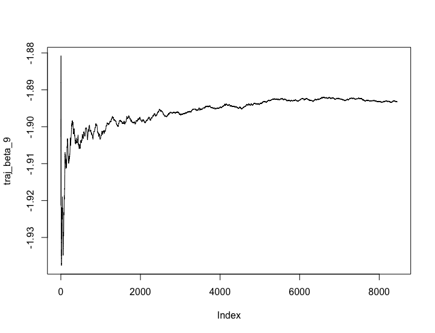

\newpage

# 1 - Normal model, mixture of normal model with semi-conjugate prior

## 1a) - Normal model

The code for the Gibbs implementation can be seen in [appendix 1](#code---1). 

By plotting the trajectories of the sampled Markov chains it can be seen that $\sigma$ and $\mu$ converges around 39 and 32 respectively. 

{width=50%}

\newpage

##1b) - Mixture normal model

The results of the Gibbs sampling data augmentation algorithm given in NormalMixtureModel.R resulted can be seen below. 

{height=35%,margin=0}

{height=35%,width=50%,margin=0}


Both $\mu$ and $\sigma$ converged after a few samples. 

##1c) - Graphical comparison

The figure below shows a comparison between the samplers. The blue line represents the normal density from excercise a, and the green line represents the mixture of normals density from excercise b. Both of the models have limitations when it comes to fit the data. 


\newpage

#2 - Metropolis Random Walk for Poisson regression

##2a) 

The table below shows the p-values for each parameter. The p-value given for the Z-statistic can be interpreted as how likely it is that a result as extreme or more extreme than that observed would have occured under the null hypothesis. Thus, the covariates MinBidShare, Sealed, and VerifyID seams to be the most significant ones, whereas MinBlem is the least significant one. 

\begin{table}[ht]
\center
\begin{tabular}{rrrrrrrrrr}
\hline
Const     & PowerSeller & VerifyID & Sealed   & Minblem  & MajBlem  & LargNeg  & LogBook  & MinBidShare \\ \hline
4.56e-266 & 5.76e-01    & 1.96e-05 & 1.66e-18 & 3.85e-01 & 1.57e-02 & 2.09e-01 & 3.09e-05 & 9.42e-156   \\ \hline
\end{tabular}
\end{table}

##2b)

The logistic Poisson regression resulted in the following values for $\beta$s and $\sigma^2$s. 

\begin{table}[ht]
\centering:
\begin{tabular}{rrrrrrrrrr}
  \hline
 & Const & PowerSeller & VerifyID & Sealed & Minblem & MajBlem & LargNeg & LogBook & MinBidShare\\ 
  \hline
$\sigma$ & 0.4932 & 0.6767 & 1.4006 & 1.0888 & 1.0942 & 1.7190 & 1.1535 & 0.5236 & 1.0231545\\ 
   \hline
$\hat\beta$ & .33285 & -0.28581 &  0.03928 & -0.14391 & -0.21800 & -0.19890 & -0.19947 & -0.15492 & -0.22178 \\
\end{tabular}
\caption{Posterior mode and standard diviation} 
\end{table}

\newpage

##2c)

The result below is from 50 000 sample draws from the posterior. In order to analyze the convergence, the trajectories of $\beta_9$ are plotted in the figure below. As can be seen, the samples are converging after 6000 iterations. 



\newpage

# Code - 1

```{r, echo=TRUE, eval=FALSE}
data = read.table("rainfall.txt", col.names = "x")

########### A ###########
# parameter init values
mu0 <- 30
tau0 <- 1
v0 <- 0
sigma0 <- 10

n <- nrow(data)
dataMean <- mean(data$x)
vn <- v0 + n

iter <- 1000

# draw mu 
drawMu <- function(prevMu, prevSigma) {
  tauSq <- 1/( (n/prevSigma) + (1/tau0^2) ) 
  w <- (n/prevSigma)/((n/prevSigma) + (1/tau0^2))
  mu <- w*dataMean + (1-w)*mu0
  draw <- rnorm(1, mu, sqrt(tauSq))
  return (draw)
}
#inv chi square
invChiSquare <- function(v, s) {
  return(v*s / rchisq(1,v))
}

# draw sigma 
drawSigma <- function(mu) {
  sum <- 0 
  for (i in 1:n) {
    sum <- sum + (data[i,1] - mu)^2
  }
  s <- (v0*sigma0 + sum)/(n+v0)
  return(invChiSquare(vn, s))
}

mu <- c()
sigma2 <- c()

currMu <- 32 
currSigma <- sigma0
for (i in 1:iter) {
  if(i %% 2 == 0) {
    currMu <- drawMu(currMu, currSigma)
  } else {
    currSigma <- drawSigma(currMu) 
  }
  mu <- c(mu, currMu)
  print(length(mu))
  sigma2 <- c(sigma2, currSigma)
}

## plot trajectories of sampled mu and sigma
plot(mu, sqrt(sigma2),type='l')

# Also consider plotting the trajectories (the sampled values of mu and sigma2) over the iterations.
meanMeans = c()
meanVars = c()
for (i in 2:iter){
  # if(i%%2 == 0){
    # the trajector between the current and previous mu/sigma
    meanMeans = c(meanMeans, mean(mu[i-1:i]))
    meanVars = c(meanVars, mean(sigma2[i-1:i]))
  #}
}
plot(meanMeans, type='l', xlim=c(0,1000))
plot(sqrt(meanVars), type='l', xlim=c(0,1000))

########## C #########

densityData = density(data$x)

xGrid = seq(min(densityData$x),max(densityData$x),length = length(densityData$x))
ndens = dnorm(xGrid, mean(mu), mean(sqrt(sigma2)))

hist(data$x, 50, freq = FALSE)

lines(xGrid,
      ndens, 
      col='blue')

lines(mixDens, 
      col = 'green')

legend("topright", 
       box.lty = 1, 
       legend = c("Data",'Normal model', 'Mixed models'), 
       col = c("black",'blue', 'green'), 
       lwd = 2)
```

\newpage

# Code - 2

```{r, echo=TRUE, eval=FALSE}
data = read.table("rainfall.txt", col.names = "x")
library(mvtnorm)

data <- read.table("eBayNumberOfBidderData.txt", header = TRUE)

########## A ##########

#The significance of a parameter is not governed by its estimated 
#absolute value, but by e.g. the p-value. Use e.g. summary(fit).

fit <- glm(nBids ~ 0 + ., data, family = poisson)

#Obtain p-values
p_values <- coef(summary(fit))[,4]

coeff <- t(fit$coefficients)
plot(abs(coeff), type='h', 
     lwd=2, 
     xlab = "coefficient index", 
     main='Significance of covariates',
     ylab='absolute value of coefficient')

X <- as.matrix(data[,2:10])
## The most significant covariate is minBidShare. 

########## B ##########

# Your estimated beta values should be close to the ones from glm() if 
# you did it right. Double check this line:

sigmaPrior <- 100 * solve(t(X)%*%X)

logPois <- function(beta, y, X, ...) {
  # log likelihood of poisson model
  if(!is.null(dim(beta))) {
    beta <- beta[1,]
  }
  
  lambda <- exp(X%*%beta)
  logLik <- sum(dpois(y, lambda, log=TRUE))
  
  if (logLik == -Inf) {
    logLik <- -2000
  }
  # logLik <- logLik + y[i] * t(beta)%*%x[i,] - exp( t(beta)%*%x[i,] - log(factorial(y[i])))
  # log of prior
  logPrior <- dmvnorm(beta, mean = rep(0, 9), sigma = sigmaPrior, log=TRUE)
  # add 
  return(logLik + logPrior)
}

OptimResults<-optim(coeff,logPois,gr=NULL, y = data$nBids,X = X, method=c("BFGS"),control=list(fnscale=-1),hessian=TRUE)

postCov <- -solve(OptimResults$hessian)
st_div <- sqrt(diag(postCov))
betaMode <- OptimResults$par

########## C ##########
# Also plot the MCMC trajectories for the different betas. 
# Your results will be different when you fix 2b) also.

gaussianSample <- function(theta, sigma, c) {
  val <- rmvnorm(1, theta, c*sigma)
  return (val)
}

RWMSampler <- function(c, it, initBeta, fn, ...) {
  accRate <- 0
  sample <- c()
  prev <- gaussianSample(initBeta, postCov, c)
  for (i in 1:it) {
    candidate <- gaussianSample(prev, postCov, c)
    
    alpha <- min(1, exp( fn(candidate, ...) - fn(prev, ...) ))
    u <- runif(1, 0, 1)
    if (alpha >= u) {
      # accept candidate
      prev <- candidate
      accRate <- accRate + 1
      # as matrix
      sample <- rbind(sample, prev)
    }
  }
  return (sample)
}

# sample with random walk metropolis
sample <- RWMSampler(1,50000,betaMode, logPois, as.vector(data$nBids), X)
hist(sample[,9])
plot(sample[,1],
     sample[,2],
     type='l',
     xlab = expression(beta[1]),
     ylab = expression(beta[2]),
     main = expression("Samples of" ~ beta[1] ~ "and" ~ beta[2])
     )

# plot trajectoroies for beta 9 
traj_beta_9 = c()
for (i in 11:length(sample[,9])) {
    traj_beta_9 = c(traj_beta_1, mean(sample[i-10:i,9]))
}
plot(traj_beta_9, type = 'l')
dev.off()
```
