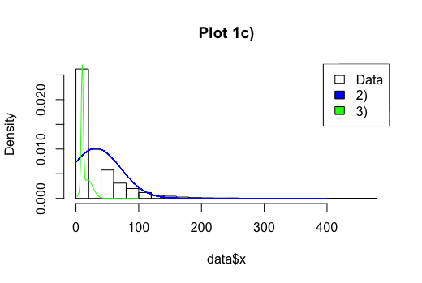

```{r setup, include=FALSE}
knitr::opts_chunk$set(echo = TRUE)
```

\newpage

# 1 - Normal model, mixture of normal model with semi-conjugate prior

## 1a) - Normal model

The code for the Gibbs implementation can be seen below. 

```{r, echo=TRUE, eval=FALSE}
# draw mu 
drawMu <- function(prevMu, prevSigma) {
  tauSq <- 1/( (n/prevSigma) + (1/tau0^2) ) 
  w <- (n/prevSigma)/((n/prevSigma) + (1/tau0^2))
  mu <- w*dataMean + (1-w)*mu0
  draw <- rnorm(1, mu, sqrt(tauSq))
  return (draw)
}
#inv chi square
invChiSquare <- function(v, s) {
  return(v*s / rchisq(1,v))
}

# draw sigma 
drawSigma <- function(mu) {
  sum <- 0 
  for (i in 1:n) {
    sum <- sum + (data[i,1] - mu)^2
  }
  s <- (v0*sigma0 + sum)/(n+v0)
  return(invChiSquare(vn, s))
}

mu <- c()
sigma2 <- c()

currMu <- 32 
currSigma <- sigma0
for (i in 1:iter) {
  if(i %% 2 == 0) {
    currMu <- drawMu(currMu, currSigma)
  } else {
    currSigma <- drawSigma(currMu) 
  }
  mu <- c(mu, currMu)
  sigma2 <- c(sigma2, currSigma)
}

```
By plotting the trajectories of the sampled Markov chains it can be seen that $\sigma$ and $\mu$ converges around 39 and 32 respectively. 


##1b) - Mixture normal model

The results of the Gibbs sampling data augmentation algorithm given in NormalMixtureModel.R resulted can be seen below. 


Both $\mu$ and $\sigma$ converged after a few samples. 

##1c) - Graphical comparison

The figure below shows a comparison between the samplers. The blue line represents the normal density from excercise a, and the green line represents the mixture of normals density from excercise b. Both of the models have limitations when it comes to fit the data. 



