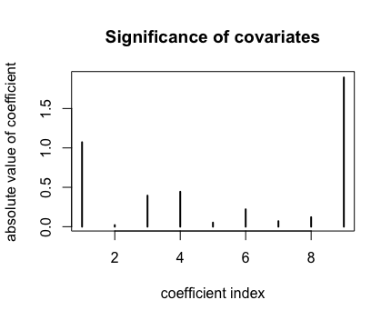

```{r setup, include=FALSE}
knitr::opts_chunk$set(echo = TRUE)
```

\newpage

# 1 - Normal model, mixture of normal model with semi-conjugate prior

## 1a) - Normal model

The code for the Gibbs implementation can be seen in [appendix 1](#code---1). 

By plotting the trajectories of the sampled Markov chains it can be seen that $\sigma$ and $\mu$ converges around 39 and 32 respectively. 

{width=50%}

\newpage

##1b) - Mixture normal model

The results of the Gibbs sampling data augmentation algorithm given in NormalMixtureModel.R resulted can be seen below. 

<center>
{width=50%}
{width=50%}
</center>

Both $\mu$ and $\sigma$ converged after a few samples. 

##1c) - Graphical comparison

The figure below shows a comparison between the samplers. The blue line represents the normal density from excercise a, and the green line represents the mixture of normals density from excercise b. Both of the models have limitations when it comes to fit the data. 

{width=50%}

\newpage

#2 - Metropolis Random Walk for Poisson regression

##2a) 

The absolute values of the parameters obtained by a maximum likelihood estimation is shown below.

<center>
{width=50%}
</center>

The figure shows that the ninth parameter, meaning minBidShare, is the most significant covariate, whereas PowerSeller is the least significant. 

##2b)

The logistic Poisson regression resulted in the following values for $\beta$s

\begin{table}[ht]
\centering:
\begin{tabular}{rrrrrrrrrr}
  \hline
 & Const & PowerSeller & VerifyID & Sealed & Minblem & MajBlem & LargNeg & LogBook & MinBidShare\\ 
  \hline
$\sigma$ & 0.4932 & 0.6767 & 1.4006 & 1.0888 & 1.0942 & 1.7190 & 1.1535 & 0.5236 & 1.0231545\\ 
   \hline
$\hat\beta$ & .33285 & -0.28581 &  0.03928 & -0.14391 & -0.21800 & -0.19890 & -0.19947 & -0.15492 & -0.22178 \\
\end{tabular}
\caption{Posterior mode and stdev} 
\end{table}

\newpage

##2c)

The result below is from 50 000 sample draws from the posterior. In order to analyze the convergence, $\beta_1$ and $\beta_2$ are plotted in the same plot. As can be seen, most of the samples are drawn from a oval-shaped distribution centered around the modes of the betas. Thus, the algorithm has converged. 

{width=50%}

\newpage

# Code - 1


```{r, echo=TRUE, eval=FALSE}

data = read.table("rainfall.txt", col.names = "x")

########### A ###########

# parameter init values
mu0 <- 30
tau0 <- 1
v0 <- 0
sigma0 <- 10

n <- nrow(data)
dataMean <- mean(data$x)
vn <- v0 + n

iter <- 1000

# draw mu 
drawMu <- function(prevMu, prevSigma) {
  tauSq <- 1/( (n/prevSigma) + (1/tau0^2) ) 
  w <- (n/prevSigma)/((n/prevSigma) + (1/tau0^2))
  mu <- w*dataMean + (1-w)*mu0
  draw <- rnorm(1, mu, sqrt(tauSq))
  return (draw)
}
#inv chi square
invChiSquare <- function(v, s) {
  return(v*s / rchisq(1,v))
}

# draw sigma 
drawSigma <- function(mu) {
  sum <- 0 
  for (i in 1:n) {
    sum <- sum + (data[i,1] - mu)^2
  }
  s <- (v0*sigma0 + sum)/(n+v0)
  return(invChiSquare(vn, s))
}

mu <- c()
sigma2 <- c()

currMu <- 32 
currSigma <- sigma0
for (i in 1:iter) {
  if(i %% 2 == 0) {
    currMu <- drawMu(currMu, currSigma)
  } else {
    currSigma <- drawSigma(currMu) 
  }
  mu <- c(mu, currMu)
  sigma2 <- c(sigma2, currSigma)
}

## plot trajactories of sampled mu and sigma
plot(mu, sqrt(sigma2),type='l')

########## C #########
xGrid <- seq(0,400,by=(100/n))
ndens <- dnorm(xGrid, mean(mu), mean(sqrt(sigma2)))

hist(data$x, 20, main = 'Plot 1c)', freq = FALSE, xlab='')
lines(xGrid, ndens, col='blue')
lines(mixDensMean, col = 'green')
legend("topright", box.lty = 1, legend = c("Data",'2)', '3)'), 
       col = c("white",'blue', 'green'), lwd = 2)

```

\newpage

# Code - 2

```{r, echo=TRUE, eval=FALSE}
library(mvtnorm)

data <- read.table("eBayNumberOfBidderData.txt", header = TRUE)


########## A ##########
fit <- glm(nBids ~ 0 + ., data, family = poisson)
coeff <- fit$coefficients
plot(abs(coeff), type='h', 
     lwd=2, 
     xlab = "coefficient index", 
     main='Significance of covariates',
     ylab='absolute value of coefficient')

X <- as.matrix(data[,2:10])
## The most significant covariate is minBidShare. 

########## B ##########
sigmaPrior <- 100 * solve(t(X)%*%X)

logPois <- function(beta, y, x, ...) {
  # log likelihood of poisson model

  n <- length(x)
  
  logLik <- 0
  for (i in 1:length(n)) {
    logLik <- logLik + y[i] * t(beta)%*%x[i,] - exp( t(beta)%*%x[i,] - log(factorial(y[i])))
  }
  
  # log of prior
  logPrior <- dmvnorm(beta, mean = rep(0, 9), sigma = sigmaPrior, log=TRUE)
  
  # add 
  return(logLik + logPrior)
}

OptimResults<-optim(coeff,logPois,gr=NULL, y = data$nBids,x = X,method=c("BFGS"),control=list(fnscale=-1),hessian=TRUE)


postCov <- -solve(OptimResults$hessian)
st_div <- sqrt(diag(postCov))
betaMode <- OptimResults$par

########## C ##########

gaussianSample <- function(theta, sigma, c) {
  val <- rmvnorm(1, theta, c*sigma)
  return (val)
}


RWMSampler <- function(c, it, initBeta, fn, ...) {
  accRate <- 0
  sample <- c()
  prev <- gaussianSample(initBeta, postCov, c)
  for (i in 1:it) {
    candidate <- gaussianSample(prev, postCov, c)
    alpha <- min(1,exp(fn(prev, ...) - fn(candidate, ...)))
    u <- runif(1, 0, 1)
    if (alpha <= u) {
      # accept candidate
      prev <- candidate
      accRate <- accRate + 1
      # as matrix
      sample <- rbind(sample, prev)
    }
  }
  return (sample)
}

sample = RWMSampler(1,50000,betaMode, logPois, data$nBids, X)
plot(sample[,1], sample[,2],
     type='l',
     xlab = expression(beta[1]),
     ylab = expression(beta[2]),
     main = expression("Samples of" ~ beta[1] ~ "and" ~ beta[2]))

```